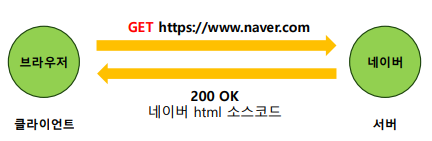

# 1주차
## Web
인터넷에 연결된 사용자들이 서로의 정보를 공유할 수 있는 공간

### 클라이언트-서버 모델(Client-Server model)*
인터넷 상에서 정보를 주고 받는 분산 어플리케이션 구조
- 클라이언트(Client): 데이터의 생성/조회/수정/삭제를 서버에 요청
- 서버(Server): 클라이언트의 요청에 따라 알맞은 동작을 수행하고 그에 따른 응답을 전송

### HTTP(Hyper Text Transfer Protocol)
클라이언트-서버 모델에서 request-response 기능을 하는 프로토콜이다.
클라이언트가 서버에게 HTTP request message를 전송하면 서버는 HTML파일같은 자원들을 response message에 담아 응답한다.



#### HTTP Header
전송 주체에 따라 Request Header와 Reponse Header로 나뉜다.

- Request header 예시
  ```makefile
  GET /api/data HTTP/1.1
  Host: www.example.com
  User-Agent: Mozilla/5.0
  Accept: application/json
  Authorization: Bearer abc123token
  ```
HTTP 요청을 보낼 때 어떤 위치에 있는 데이터를(URL) 어떻게 할 것인지(HTTP Method) 알 수 있다.
> ex. `GET /api/users/1` : id=1인 유저 정보 조회

  | 메서드    | 설명                        |
  |--------|---------------------------|
  | GET    | 리소스 조회                    |
  | POST   | 리소스 생성                    |
  | PUT    | 리소스 전체 수정. 존재하지 않으면 새로 생성 |
  | PATCH  | 리소스 부분 수정                 |
  | DELETE | 리소스 삭제                    |
POST는 새로운 리소스를 계속해서 서버에 추가, PUT은 특정 리소스를 대체, PATCH는 특정 리소스를 일부 수정한다.

또한, GET은 보통 URL query로 전달하는 경우가 대부분이다.

- Response header 예시
  ```makefile
  HTTP/1.1 200 OK
  Content-Type: application/json
  Content-Length: 123
  Set-Cookie: sessionId=abc123; HttpOnly
  Cache-Control: no-store
  ```

| 상태 코드 | 의미                    | 설명                         |
|-------|-----------------------|----------------------------|
| 200   | OK                    | 요청이 성공적으로 처리됨              |
| 201   | Created               | 요청에 의해 리소스가 성공적으로 생성됨      |
| 204   | No Content            | 요청은 성공했지만 응답 본문이 없음        |
| 301   | Moved Permanently     | 요청한 리소스가 영구적으로 이동됨 (리다이렉션) |
| 302   | Found                 | 임시 리다이렉션                   |
| 400   | Bad Request           | 잘못된 문법의 요청                 |
| 401   | Unauthorized          | 인증 필요 (로그인이 안 됨)           |
| 403   | Forbidden             | 접근 권한 없음 (로그인은 되어 있음)      |
| 404   | Not Found             | 요청한 리소스를 찾을 수 없음           |
| 405   | Method Not Allowed    | 허용되지 않은 HTTP 메서드 사용        |
| 500   | Internal Server Error | 서버 내부 오류                   |
| 502   | Bad Gateway           | 게이트웨이 또는 프록시 서버 오류         |
| 503   | Service Unavailable   | 서버가 일시적으로 사용 불가능           |

#### HTTP Body
전송할 데이터가 들어있으며 JSON 형식이 많이 사용된다. request method에 따라 생략 가능하다.(단순 데이터 조회 요청일 경우)

```json
{
  "name": "kim",
  "age": 20
}
```

## 프론트엔드와 백엔드
자주 변하지 않는 화면 UI와 자주 변하는 컨텐츠를 분리
- 프론트는 화면에 채울 컨텐츠 데이터를 백엔드에게 요청
- 백엔드는 DB에서 컨텐츠 데이터를 가져와 프론트에게 응답


### API(Application Programming Interface)
어떤 기능을 사용하기 위해 어떤 HTTP Method, URL을 사용해야 하는지 정의한 것.

#### REST API
> 자원은 URL로, 동작은 HTTP 메서드로 표현하는 간결하고 일관된 웹 API 설계 방식

- RESTful API 핵심 원칙

| 원칙         | 설명                                                    |
|------------|-------------------------------------------------------|
| 자원의 명확한 표현 | URI는 자원을 명사로 표현해야 함 (`/users`, `/products`)           |
| 메서드에 따른 행위 | HTTP Method (`GET`, `POST`, `PUT`, `DELETE`)로 행위를 구분함 |
| 무상태성       | 각 요청은 독립적이며, 서버는 이전 요청 상태를 저장하지 않음                    |
| 표현의 일관성    | 데이터는 JSON 등으로 표현되며, 클라이언트는 이를 해석함                     |
| 계층 구조      | 클라이언트는 서버 구조를 몰라도 됨. 여러 계층(프록시, 인증서버 등) 가능            |

- 좋은 예와 나쁜 예

| 목적    | 좋은 예 (RESTful)             | 나쁜 예 (RESTful하지 않음)    |
|-------|----------------------------|------------------------|
| 유저 조회 | `GET /users/1`             | `GET /getUser?id=1`    |
| 유저 생성 | `POST /users`              | `POST /createUser`     |
| 유저 삭제 | `DELETE /users/1`          | `GET /deleteUser?id=1` |
| 상품 검색 | `GET /products?name=apple` | `POST /searchProduct`  |

- RESTful API의 장점

| 장점      | 설명                                  |
|---------|-------------------------------------|
| 일관성     | 메서드와 URL 규칙이 명확해 사용법이 직관적임          |
| 확장성     | 자원 중심 구조로 새로운 기능 추가가 유연함            |
| 범용성     | HTTP 기반이므로 모든 플랫폼, 언어에서 사용 가능       |
| 유지보수 용이 | 프론트엔드와 백엔드 간 역할이 분리되어 협업 및 유지보수가 쉬움 |
| 캐시 가능   | GET 요청은 HTTP 캐시를 활용할 수 있어 성능 향상 가능  |

## 과제
### 1. API 명세 작성
| HTTP Method | URL(path)                    | 기능        |
|-------------|------------------------------|-----------|
|             |                              |           |
| GET         | `/todo/list`                 | 할 일 전체 조회 |
| GET         | `/todo/{todo_id}`            | 할 일 조회    |
| GET         | `/friend/list`               | 친구 리스트 조회 |
| GET         | `/friend/{todo_id}`          | 친구 할 일 조회 |
| POST        | `/todo`                      | 할 일 생성    |
| PATCH       | `/todo/{todo_id}`            | 할 일 수정    |  
| DELETE      | `/todo/{todo_id}`            | 할 일 삭제    |
| POST        | `/todo/{todo_id}/check`      | 할 일 체크    |
| POST        | `/todo/{todo_id}/uncheck`    | 할 일 체크해제  |
| POST        | `/login`                     | 로그인       |
| POST        | `/logout`                    | 로그아웃      |
| POST        | `/register`                  | 회원가입      |
| POST        | `/like`                      | 좋아요       |
| POST        | `/friend/{todo_id}/follow`   | 팔로우       |
| POST        | `/friend/{todo_id}/unfollow` | 언팔로우      |


### 2. 스프링 개발 환경 준비
