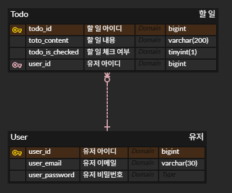
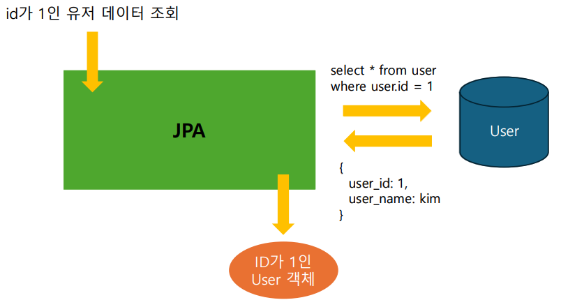

# 3주차
## DataBase(DB) 설계
### ER Model
> 문제 상황을 **개체**와 **관계**로 표현하는 방법
 
| 용어                   | 설명                                                   | 데이터베이스 표현 방식             |
|----------------------|------------------------------------------------------|--------------------------|
| **개체(Entity)**       | 문제 상황을 구성하는 독립된 요소                                   | 테이블 (Table)              |
| **관계(Relationship)** | 개체 간의 연결 또는 상호작용                                     | 테이블 또는 외래키 (Foreign Key) |
| **속성(Attribute)**    | 개체 또는 관계의 세부 속성<br/>PK(Primary Key): 개체를 식별하는 고유한 속성 | 컬럼 (Column)              |

이를 다이어그램으로 나타낸 것을 ***ERD(Entity-Relationship Diagram)*** 이라고 한다.

*ERD 예시*


### 관계
개체와 개체 사이의 관계로, 일반적으로 아래 세 가지 형태로 나타난다.  
- `1:1` 관계: 하나의 개체가 단 하나의 개체와만 관계를 맺을 수 있다
- `1:N` 관계: 하나의 개체가 여러 개체와 관계를 맺을 수 있다
- `N:M` 관계: 여러 개체가 서로 여러 개체와 관계를 맺을 수 있다

#### 1:N, N:M 관계
- 식별 관계: 관계 대상의 PK를 자신의 PK로도 사용하는 것
- 비식별 관계: 관계 대상의 PK를 자신의 FK로 사용하는 것

## JPA(Java Persistence API)
DB에서 읽어온 데이터를 자바 객체로 매핑하는 자바의 표준 기술(ORM)

### 엔티티(Entity)
ERD의 Entity와는 다른 개념으로, 자바와 데이터베이스가 소통하는 단위이다.
테이블의 레코드는 엔티티 객체 하나로 매핑된다.

엔티티 클래스를 정의하면, JPA가 엔티티 클래스 정의를 보고 테이블을 생성하는 SQL을 알아서 작성하고 실행한다.
이 때, CRUD와 관련된 SQL도 알아서 작성해준다.

```java
@Entity
@Getter
@NoArgsConstructor(access = AccessLevel.PROTECTED)
public class Todo {

    public Todo(String content, boolean isChecked, Member member) {
        this.content = content;
        this.isChecked = isChecked;
        this.member = member;
    }

    @Id
    @GeneratedValue(strategy = GenerationType.IDENTITY)
    @Column(name = "todo_id")
    private Long id;

    @Column(name = "todo_content", columnDefinition = "varchar(200)")
    private String content;

    @Column(name = "todo_is_checked", columnDefinition = "tinyint(1)")
    private boolean isChecked;

    @JoinColumn(name = "member_id")
    @ManyToOne(fetch = FetchType.LAZY)
    private Member member;
}
```
- `@Entity`: 해당 클래스가 엔티티라는 것을 명시
- `@NoArgsConstructor`: 기본 생성자를 자동으로 생성
- `@Id`: 해당 필드가 PK라는 것을 명시. 모든 엔티티엔 반드시 PK가 존재해야 한다.
- `@GeneratedValue`: 자동으로 id값을 생성한다. `strategy = GenerationType.IDENTITY`는 id 값 생성을 DB에 위임한다는 뜻이다.
- `@Column`: Column의 속성을 수동으로 설정
  - `name`: DB에 저장되는 Column의 속성
  - `columnDefinition`: 저장되는 데이터의 속성
- `@JoinColumn(name = "member_id")`: 테이블 간 FK를 매핑할 때 사용
- `@ManyToOne(fetch = FetchType.LAZY)`: *N:1*관계. fetchtype엔 EAGER, LAZY가 존재
  - EAGER: 엔티티를 조회할 때 연관 객체도 바로 함께 조회
  - LAZY: 필요할 때 연관 객체를 조회
  
```shell
Hibernate: 
    drop table if exists todo
Hibernate: 
    create table todo (
        todo_is_checked tinyint(1),
        todo_id bigint not null auto_increment,
        todo_content varchar(200),
        primary key (todo_id)
    ) engine=InnoDB
```
엔티티 정보를 기반으로 테이블 생성

***JPA를 사용함으로써 SQL을 작성하는 시간이 줄어들었다.***


