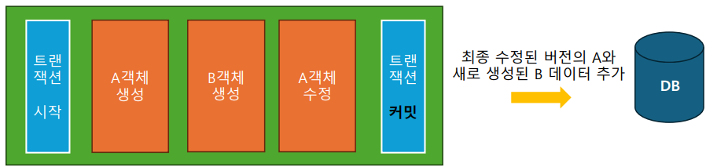
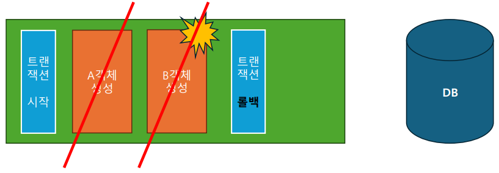

# 4주차
## Repository
- DB와 소통하며 데이터를 조작하는 계층(**CRUD**; Create, Read, Update, Delete)
- 서비스 계층이 결정한 비즈니스 로직을 실제 DB에 적용

### Entity Manager
DB와 직접 소통하는 객체로, JPA에 의해 `application.yml`정보를 기반으로 생성된다.

- 새로 생성한 엔티티 객체를 DB에 추가
- DB에서 조회한 데이터로 엔티티 객체 생성
- 엔티티 객체에 대한 수정, 삭제를 DB에 반영

### Transaction
JPA가 동작하는 단위. 트랜잭션이 끝나면 모든 변경사항을 DB에 반영한다(트랜잭션 커밋).
`@Transactional`어노테이션을 사용

*ex. 회원가입 시 쿠폰을 발급하는 기능을 구현했을 때, 회원가입과 쿠폰 생성은 하나의 트랜잭션이다.*


이 때, 트랜잭션 처리 도중 에러가 발생하면, 트랜잭션 범위 내 모든 변경점을 되돌린다. → *롤백*

이같이 한 트랜잭션 내 모든 처리 결과가 반영되거나, 아니면 전부 반영되지 않는 이러한 속성을 **원자성(Atomicity)** 이라 한다.

### 영속성 컨텍스트(Persistence Context)
- DB에서 조회한 엔티티를 캐싱하는 공간
- JPA가 DB에 반영할 엔티티의 모든 변경 사항을 임시로 보관하는 공간
- 엔티티에 대한 변경 사항을 저장해 두었다가, 트랜잭션을 커밋하면 저장된 모든 변경점이 DB에 반영되도록 영속성 컨텍스트를 기반으로 한번에 SQL을 생성한다.

#### 1. 엔티티 저장
1. 객체 생성(비영속 상태)
2. `em.persist()` em(Entity Manager)의 `persist()`메서드를 호출해 엔티티를 영속성 컨텍스트에 등록한다.
3. Insert query를 생성해 트랜잭션 커밋 또는 `flush()`메서드 호출 시 쿼리가 한번에 실행된다(쓰기지연).

#### 2. 엔티티 조회
1. `find()`메서드를 사용해 Select Query를 생성
2. DB에서 가져온 데이터를 이용해 엔티티를 생성하여 영속성 컨텍스트에 저장(캐싱)
3. 영속성 컨텍스트에 저장된 엔티티를 조회
4. 조회하려는 데이터가 이미 `find()`를 이용해 조회된 경우, 따로 쿼리를 생성하지 않고 컨텍스트에서 바로 조회
   
→ ***1차 캐시, 동일 객체 보장***

#### 3. 엔티티 수정
1. `find()`를 통해 데이터 조회 및 엔티티 생성
2. 컨텍스트 안에 있는 객체를 수정하면, 수정된 정보와 최초 상태를 비교해 SQL 생성(변경 감지)
3. 트랜잭션 커밋 또는 `flush()`호출 시 생성된 쿼리 실행

#### 4. 엔티티 삭제
1. `find()`를 통해 데이터 조회 및 엔티티 생성
2. `remove()`를 통해 컨텍스트 내 엔티티를 삭제 상태로 변경
3. 트랜잭션 커밋 또는 `flush()`호출 시 생성된 쿼리 실행

따라서 엔티티 매니저에게 데이터 변경을 요청하고 싶다면, **엔티티 객체**를 **영속성 컨텍스트**에 올려둔 뒤, 해당 객체를 변경하면 된다.

- JPQL
```jpaql
select t from Todo as t where t.user = :user
```
`setParameter("user", {user})`를 통해 대입 가능
