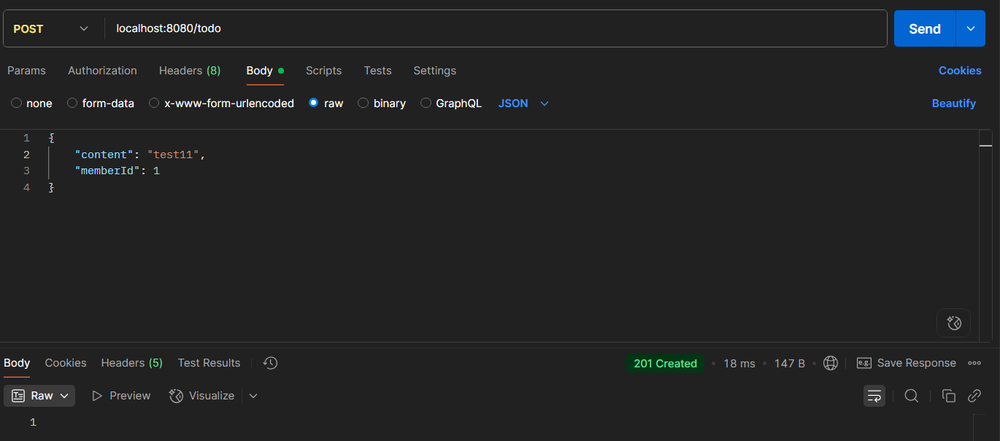

# 5주차

## 서비스 계층
- 어플리케이션의 **비즈니스 로직**이 위치하는 계층
- 레포지토리 계층과 소통하며 **엔티티(Entity), DTO(Data Transfer Object)** 로 소통한다.
- 하나의 서비스 메서드는 **원자적 작업 단위(atomic)** 가 되어야 하며, 트랜잭션 처리를 통해 데이터 일관성을 보장한다.  
  ex. `@Transactional` 어노테이션 사용

## 컨트롤러 계층

- 클라이언트의 요청을 받고, 응답을 보내는 계층
- 서비스 계층과의 데이터 교환은 **DTO(Data Transfer Object)** 를 통해 이루어진다.
- 프론트와의 데이터 교환은 **JSON** 형식을 사용하는 **HTTP 요청/응답**이며, Java에서는 이를 DTO로 변환하여 처리한다

```java
@Controller
@ResponseBody

@RestController // @Controller + @ResponseBody
```
위 코드에서 `@ResponseBody`는 메서드에서 반환된 자바 객체를 Json 형식으로 바꿔 Response Body에 담아 응답하게 되는데,  
보통 `@Controller`어노테이션과 함께 쓰이는 경우가 많아 이 둘을 합친 `@RestController` 어노테이션이 존재한다.

### 전용 컨트롤러


하나의 Java 메서드는 다음의 흐름을 따른다
1. **HTTP 요청(Request)** 을 입력으로 받고
2. 서비스 계층을 통해 **비즈니스 로직을 처리**하며
3. 최종 결과를 **HTTP 응답(Response)** 으로 반환한다

```java
@RestController
@RequiredArgsConstructor
@RequestMapping("/todo")
public class TodoController {

  private final TodoService todoService;

  @PostMapping // /todo
  public void createTodo() {

  }

  @PatchMapping("/{todoId}") // /todo/{todoId}
  public void updateTodo() {

  }
}
```
- 클래스 레벨의 `@RequestMapping("/todo")`는 모든 메서드에 대해 **기본 경로를 설정**해준다.  
  → `@PostMapping`은 `/todo`에, `@PatchMapping`은 `/todo/{todoId}`에 매핑됨
- `@PostMapping`, `@PatchMapping`은 각각 `@RequestMapping(method = RequestMethod.POST)`, `@RequestMapping(method = RequestMethod.PATCH)` 의 축약 표현이다

### DTO(Data Transfer Object)
요청 본문(JSON)을 자바 객체로 받기 위한 구조
```java
@Getter
public class TodoCreateRequest {
    private String content;
    private Long memberId;
}
```
```java
@PostMapping
public void createTodo(@RequestBody TodoCreateRequest request) {
    todoService.createTodo(request.getContent(), request.getMemberId());
}
```
`@RequestBody`는 요청 **JSON을 자바 객체(DTO)로 자동 변환**하고, 이렇게 사용되는 클래스(TodoCreateRequest 등)를 DTO라고 부른다.

### 응답 생성
```java
@PostMapping
public ResponseEntity<Void> createTodo(@RequestBody TodoCreateRequest request) {    
    Long todoId = todoService.createTodo(request.getContent(), request.getMemberId());
    return ResponseEntity.created(URI.create("/todo/" + todoId)).build();
}
```
- `ResponseEntity`는 HTTP 응답을 직접 제어할 수 있는 Spring의 응답 래퍼 클래스로, 제네릭 타입을 통해 반환할 객체의 타입을 명시한다.
  여기서는 생성만 하고 별도의 응답 본문이 없기 때문에 `<Void>`로 지정하였다.
- `ResponseEntity.created(...)`는 **201 Created 상태 코드**와 함께, Location 헤더에 **새로 생성된 리소스의 URI**를 포함시킨다.  
  상황에 따라 `ok()`, `badRequest()`, `notFound()` 등 다양한 정적 팩토리 메서드를 사용할 수 있다.
- `URI.create("/todo/" + todoId)`는 새로 생성된 할 일(todo)의 고유 경로를 나타낸다.

> 지금은 편의를 위해 엔티티 클래스를 사용했지만, ***Response에도 DTO 클래스를 사용하는 것이 일반적이다.***  
> ex. `ResponseEntity<List<TodoResponse>>`

### 포스트맨(Postman)
대표적인 API 테스트 도구이다

정해진 URL로 API 요청을 보낼 경우 그에 맞는 response를 반환한다.  
위 예시에선 `201 Created`가 반환된 모습이다.
